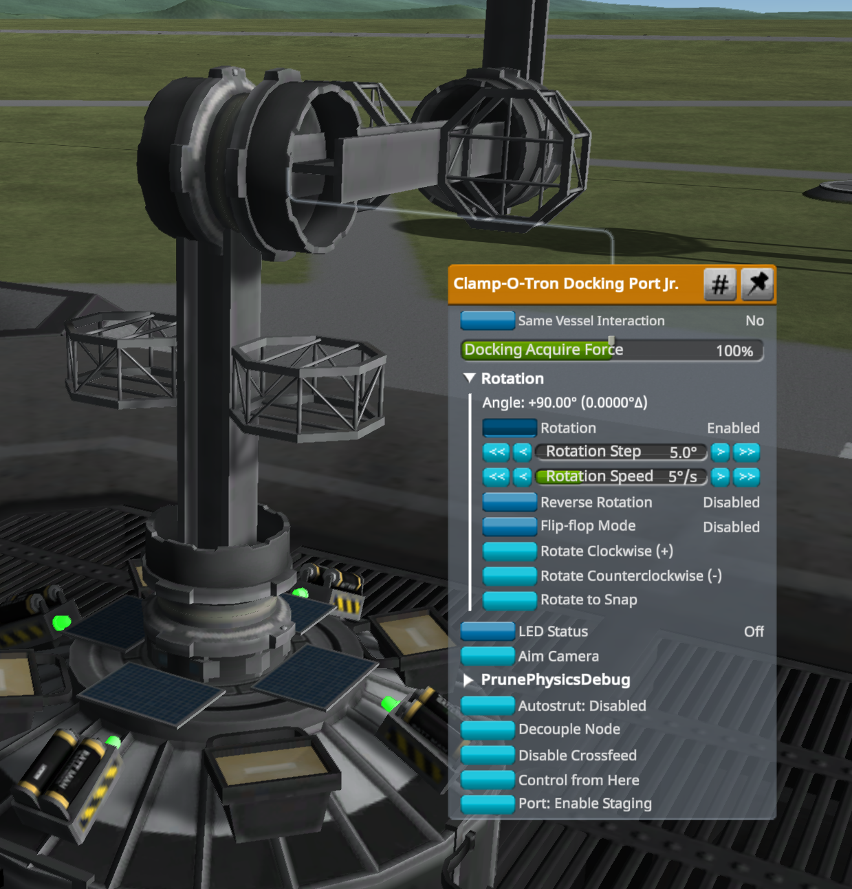
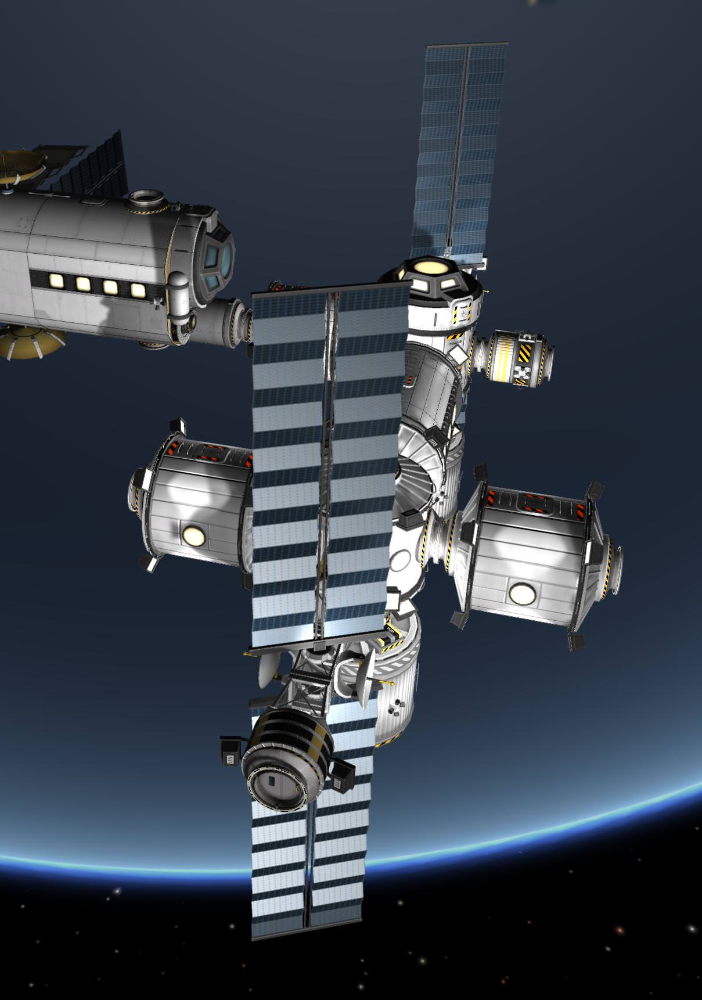
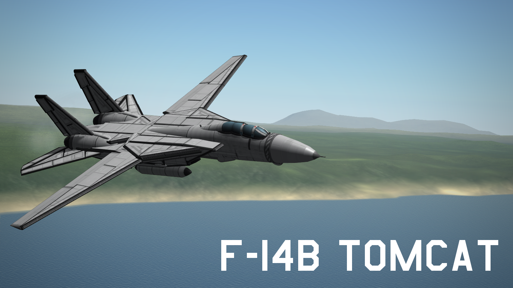
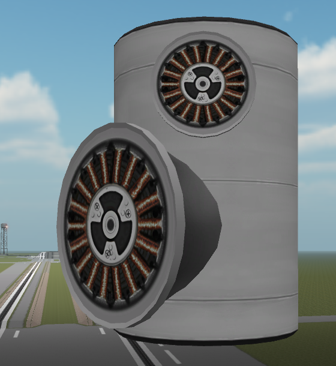
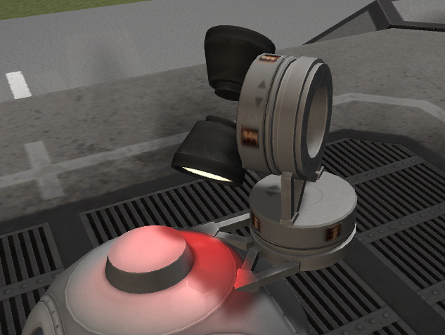

# Dock Rotate /L Unleashed :: Archive

Kerbal Space Program lightweight robotics with docking ports

[Unleashed](https://ksp.lisias.net/add-ons-unleashed/) fork by Lisias.

## In a Hurry

* [Latest Release](https://github.com/net-lisias-kspu/DockRotate/releases)
	+ [Binaries](https://github.com/net-lisias-kspu/DockRotate/tree/Archive)
* [Source](https://github.com/net-lisias-kspu/DockRotate)
* Documentation
	+ [Project's README](https://github.com/net-lisias-kspu/DockRotate/blob/master/README.md)
	+ [Install Instructions](https://github.com/net-lisias-kspu/DockRotate/blob/master/INSTALL.md)
	+ [Change Log](./CHANGE_LOG.md)
	+ [TODO](./TODO.md) list

## Description

Needing **deployable arms** for antennas on your satellites?

Wanting to try VTOL vehicles with **moving engines**?

Tired of **misaligned solar panel **trusses on your space stations?

This plugin can help you.

Docked port pairs ( * ) can rotate via `right-click menu` or `action groups` ( ** ). They can **rotate to snap** for perfect alignment. And if you want to uninstall the module, you won't lose any ship, because there's **no new parts** involved (_this is true for docking ports, but not true if you use NodeRotate parts_). Your station parts will stay aligned, and your satellite arms will stay deployed.

Rotation will malfunction if parts on opposite sides of the rotating joint are connected by struts.

All sorts of decoupling/docking/undocking/klawing/unklawing while moving are fully supported. **Yes, you can build a working Kanadarm**.

`Autostruts` are removed during motion, and restored after.

If advanced tweakables are enabled, you can access to the **experimental smart autostruts**. If the "Smart Autostruts" flag is enabled only the autostruts that cross the rotating joint are removed. This can misbehave with crossing struts, use with caution and quicksave before!

( * ) Should work with any port based on ModuleDockingNode.

( ** ) Since version 1.4.4.15, Mod key reverses action group rotations.

( *** ) DockRotate can be compatible with **Kerbal Joint Reinforcement**: see [@Geonovast](https://forum.kerbalspaceprogram.com/index.php?/profile/179753-geonovast/)'s post [here](https://forum.kerbalspaceprogram.com/index.php?/topic/170484-dockrotate-rotation-control-on-docking-ports/&do=findComment&comment=3305721).

( **** ) DockRotate is reported to work fine with **Konstruction weldable ports**: you can rotate to snap for maximum precision, then weld.

This is the right-click menu:

This is a space station with perfectly aligned solar panels:

### NodeRotate

This module can be used to turn any connection node of any physically significant part into a rotating joint.

NodeRotate is intended for modders who want to create new rotating parts. There's an example NodeRotate.cfg file in the distribution, see there for details.

## Installation

Detailed installation instructions are now on its own file (see the [In a Hurry](#in-a-hurry) section) and on the distribution file.

## License:

<License description>

Please note the copyrights and trademarks in [NOTICE](./NOTICE).

### Acknowledgements 

[@Psycho_zs](https://forum.kerbalspaceprogram.com/index.php?/profile/137644-psycho_zs/) contributed a few motor parts. You can find them in VAB/SPH in the Utility section.

This is a variable geometry F-14 Tomcat fighter made by @EvenFlow:

These are the rotating parts contributed by @Psycho_zs:

## UPSTREAM

* [DockRotate](https://forum.kerbalspaceprogram.com/index.php?/profile/144573-peteletroll/) ROOT
	+ [Forum](https://forum.kerbalspaceprogram.com/index.php?/topic/170484-*/)
	+ [Github](https://github.com/peteletroll/DockRotate)
